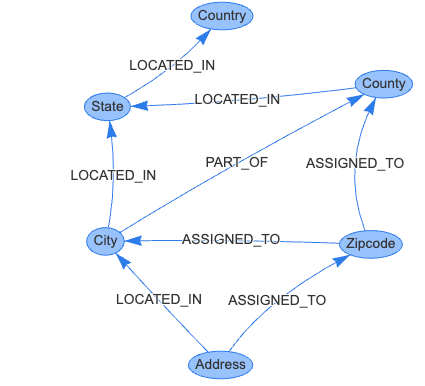

# Geospatial

{ width="400" }

[Link to Standardized Geospatial Graph Model with Vis.js](./vis.html){ .md-button .md-button--primary }
 
[Vis HTML/JavaScript Code](https://github.com/dmccreary/graph-algorithms/blob/main/docs/data/geospatial/vis.html)

A standardized geospatial model is crucial for large organizations due to several reasons:

1.  **Consistency and Accuracy**: Standardization ensures that geographical data is consistent across different departments and applications within the organization. This consistency is key for maintaining the accuracy of the data, as it reduces the risk of discrepancies that could lead to errors in decision-making or operations.

2.  **Efficient Data Integration and Sharing**: Large organizations often operate across various locations and might have multiple branches or departments dealing with geospatial data. A standardized model allows for efficient integration and sharing of data across these different entities. It simplifies the process of merging data from various sources, ensuring that everyone is using the same format and interpretation.

3.  **Improved Decision-Making**: Standardized geospatial models provide a reliable foundation for analyses and decision-making. Organizations can better assess location-based trends, demographics, logistical routes, and resource distributions, which are crucial for strategic planning, marketing, supply chain management, and other operational decisions.

4.  **Interoperability with External Systems**: A standardized model enhances interoperability with external systems, such as government databases, partner organizations, or public geospatial services. This is essential for activities like compliance with legal requirements, collaborative projects, and accessing broader datasets for enhanced insights.

5.  **Scalability and Future-Proofing**: Standardization makes it easier to scale geospatial capabilities as the organization grows. A uniform model can more readily adapt to new regions, datasets, or technologies, making it a sustainable choice for long-term development.

6.  **Cost-Effectiveness**: By standardizing their geospatial data models, organizations can reduce costs associated with data conversion, error correction, and training. It streamlines processes and reduces the need for custom solutions to handle different data formats.

7.  **Enhanced Data Quality Management**: Standardized models facilitate better data quality management. They make it easier to implement quality control measures, ensure data completeness, and maintain the integrity of geospatial data over time.

8.  **Support for Advanced Technologies**: Standardization lays the groundwork for adopting advanced technologies like AI and machine learning in geospatial analysis. Consistent data models are essential for these technologies to effectively learn patterns and provide accurate predictive insights.

In summary, for large organizations, having a standardized geospatial model is key to efficient, accurate, and cost-effective handling of geographical data. It supports better decision-making, facilitates data sharing and integration, and prepares the organization for future technological advancements.

## Sample Geospatial Rules

The models you use may be based on the following rules for US addresses:

1. Every Address is LOCATED_IN in a single City
2. Every City is LOCATED_IN in a single State
3. Every State is LOCATED_IN a single Country
4. Every County is LOCATED_IN a single State
5. Every Address is ASSIGNED_TO a single Zipcode
6. Every City is PART_OF one or more County (a city can be in many counties)
7. A Zipode is ASSIGNED_TO a single City
8. A Zipcode is ASSIGNED_TO a single County

From these rules, we can infer many other rules such as each County is
LOCATED_IN a single Country.

Note that we can now add other "regions" such as a "Metropolitan Region" which
is a collection of Cities.

!!! Prompt_Tip
    When asking generative AI to create a custom script, you can include
    only the rules that are relevant above.  Many queries will work
    with rules 1 to 5 above.

## Sample Geospatial Loaders

Once our geospatial model is fixed, we can then focus on building queries
that tie people and organizations to the Address vertex.  In general,
we only need to link an entity to an Address.  The rest of the relationships
can be inferred.  This keeps our in-memory footprint smaller and makes
queries more consistent.

## Sample Rendering with p5.js

[Link to Geospatial Model Rendered with p5.js](./geospatial.html)
[Edit GeoSpacial Model MicroSim](https://editor.p5js.org/dmccreary/sketches/6NfvxKZ_D)

[Link to the ChatGPT Dialog](https://chat.openai.com/c/847dd95d-919c-4fc1-a317-1fdac2926f71)

## Region Names

In addition to names of cities, counties and states users also frequently ask for region names.
These region names can be linked to our existing cities counties and states.

Here is a sample list of [Region Names](./region-names.md).  For each of these regions, we can ask ChatGPT to create a list of States, Counties and Cities that they include.

