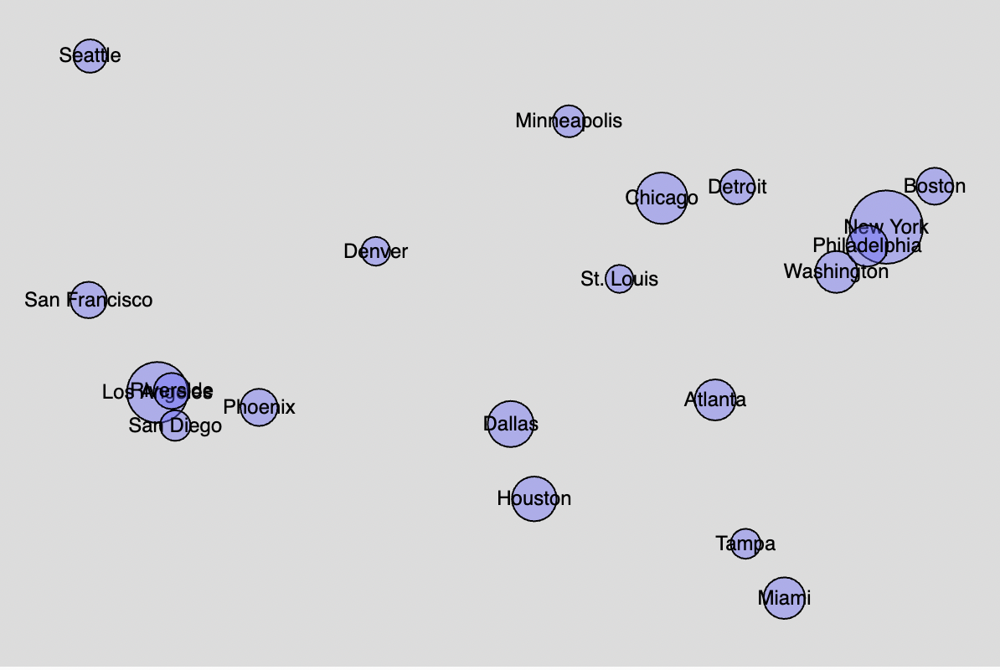

# Generating Data for US Cities



Understanding graph algorithms such as the traveling salesperson algorithm requires
we create a realistic graph that represents geo-locations.  But
manually typing the names of cities and their longitude and latitude
is a slow and painful process.  But generative AI can help us.
It is very good at generating realistic-looking synthetic data.

In this example, we will generate a small geospatial dataset we will use in this course for demonstrating graph algorithms.  We chose a dataset that we know is referenced frequently on the web: large US cities.

## Sample Prompt

```linenums="0"
Create a table of the top 20 metro areas in the US.  Add one row in the table for each metro area. Create the following columns:

1. Name of the largest city in the metro area
2. Population
3. Longitude
4. Latitude

```

You will note that we didn't really need seven digits of precision, but we can ask
ChatGPT to reduce the precision later.

## Sample Table Generate by ChatGPT

| Rank | Metropolitan Area | Population | Longitude | Latitude |
| --- |  --- |  --- |  --- |  --- |
| 1 | New York-Newark-Jersey City | 19,216,182 | \-74.0060° | 40.7128° |
| 2 | Los Angeles-Long Beach-Anaheim | 13,214,799 | \-118.2437° | 34.0522° |
| 3 | Chicago-Naperville-Elgin | 9,458,539 | \-87.6298° | 41.8781° |
| 4 | Dallas-Fort Worth-Arlington | 7,573,136 | \-96.7970° | 32.7767° |
| 5 | Houston-The Woodlands-Sugar Land | 7,122,240 | \-95.3698° | 29.7604° |
| 6 | Washington-Arlington-Alexandria | 6,280,487 | \-77.0369° | 38.9072° |
| 7 | Miami-Fort Lauderdale-Pompano Beach | 6,166,488 | \-80.1918° | 25.7617° |
| 8 | Philadelphia-Camden-Wilmington | 6,102,434 | \-75.1652° | 39.9526° |
| 9 | Atlanta-Sandy Springs-Alpharetta | 6,018,744 | \-84.3863° | 33.7490° |
| 10 | Phoenix-Mesa-Chandler | 4,948,203 | \-112.0740° | 33.4484° |
| 11 | Boston-Cambridge-Newton | 4,873,019 | \-71.0589° | 42.3601° |
| 12 | San Francisco-Oakland-Berkeley | 4,731,803 | \-122.4194° | 37.7749° |
| 13 | Riverside-San Bernardino-Ontario | 4,650,631 | \-117.3755° | 34.1083° |
| 14 | Detroit-Warren-Dearborn | 4,326,442 | \-83.0458° | 42.3314° |
| 15 | Seattle-Tacoma-Bellevue | 3,979,845 | \-122.3321° | 47.6062° |
| 16 | Minneapolis-St. Paul-Bloomington | 3,640,043 | \-93.2650° | 44.9778° |
| 17 | San Diego-Chula Vista-Carlsbad | 3,338,330 | \-117.1611° | 32.7157° |
| 18 | Tampa-St. Petersburg-Clearwater | 3,194,831 | \-82.5415° | 27.9506° |
| 19 | Denver-Aurora-Lakewood | 2,963,821 | \-104.9903° | 39.7392° |
| 20 | St. Louis | 2,803,707 | \-90.1994° | 38.6270° |

We also can ask ChatGPT to reformat this table as a [JSON file](us-cities.json)
for download.  This is the type of file format we will use in our other
demos.

!!! Caution
    ChatGPT frequently will add an extra comma to the
    end of a record set.  This will cause a load error.  We suggest
    you view the JSON file in a tool that checks syntax or use
    a JSON syntax checker.

[Run the US Cities Map MicroSim](./us-cities.html){ .md-button .md-button--primary }
[Edit](https://editor.p5js.org/dmccreary/sketches/7_BOWzJak)

[ChatGPT Dialog](https://chat.openai.com/share/a805f2cc-d10f-4f80-b47e-5d63ba3f005e)

## Example of Reading JSON File


[Demo of JSON Read MicroSim](jason-read.html)
[Edit MicroSim](https://editor.p5js.org/dmccreary/sketches/pJi64a8MK)