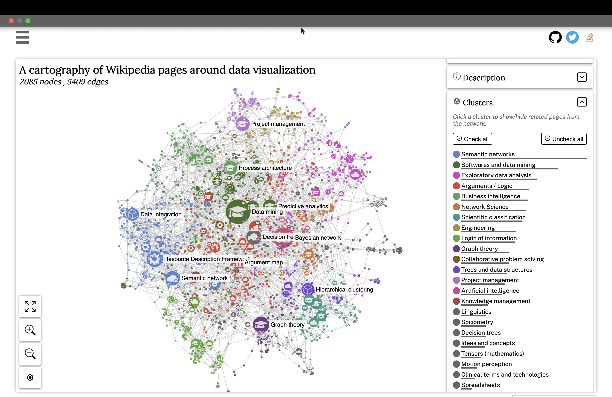

# Data Visualization

Graph modeling
Graph algorithms
Graph visualization
Graph discovery

# Data Visualization Graph

Steps to Repeat:

1. Go to the [Sigma JS Org site](https://www.sigmajs.org/)
2. Scroll down to the Data Visualization demo
3. Click the full screen icon in the left side of the viewer
4. Uncheck all
5. Check only the subset that you would like to discover