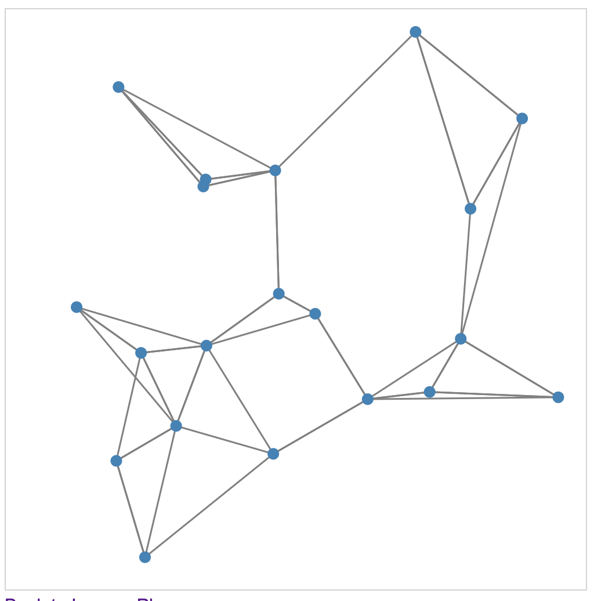
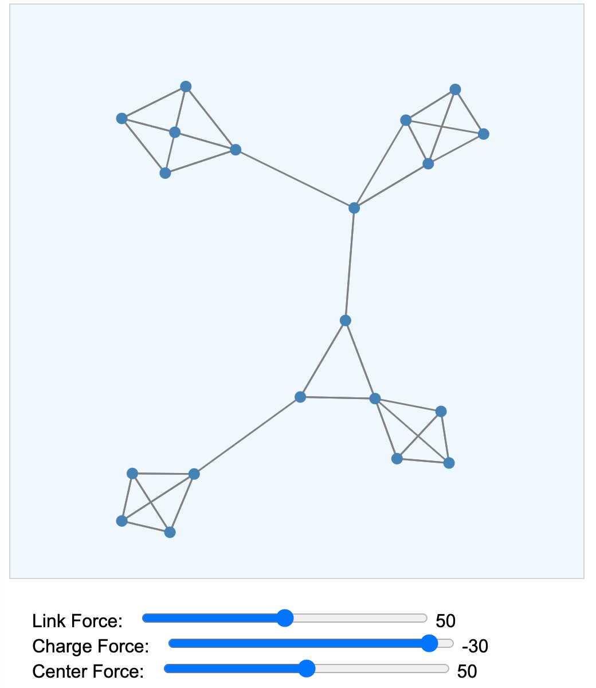

# D3 Graph Test

{ width="400px"}

[Run the 20 Vertex D3 Demo](./d3.html){ .md-button .md-button--primary }

D3 is a general-purpose charting library with a nice set
of tools for drawing graph networks.  D3 generates
SVG so if you know SVG it is easy to modify.  Because
D3 is popular there are many example programs that GPT
was trained on and GPT does a good job of generating
high-quality D3.js code.

## Prompt 1

```linenums="0"
Create a d3.js program that displays a network graph
of 20 vertices that are randomly placed on a 500x500 canvas.  
Make each node connected to the three nearest nodes.
```

## Response 1

Creating a D3.js program to display a network graph as described involves several steps. First, you'll need to generate 20 vertices with random positions on a 500x500 canvas. Then, for each vertex, you must find the three nearest vertices and draw lines (edges) to connect them. Here's a basic outline of the code you would write:

1.  **Set Up the Environment**: Include D3.js in your HTML file.
2.  **Create Vertices**: Generate 20 vertices with random x and y coordinates within the 500x500 canvas.
3.  **Calculate Nearest Neighbors**: For each vertex, calculate the distance to every other vertex and identify the three nearest ones.
4.  **Draw the Graph**: Use D3.js to draw the vertices and the edges connecting each vertex to its three nearest neighbors.

Here's a simplified version of the code you might use:


This code sets up a simple D3.js environment, generates random vertices, computes the nearest neighbors, and then uses D3.js to draw the nodes and edges on an SVG canvas. Note that this is a basic implementation and may need optimizations or enhancements based on your specific requirements.

## Prompt Force Directed Graph

```linenums="0"
OK, that is perfect.  Now can you do the same graph, but use a force-directed graph to adjust the 
spacing of the nodes on the canvas with D3?
```

Certainly! To create a force-directed graph using D3.js, you'll modify the previous setup to include D3's force simulation. The force simulation will automatically adjust the positions of the nodes based on the forces you define, such as link forces, charge forces, and centering forces.

Here's an updated version of the code to use a force-directed layout:

This code introduces a few new concepts:

1.  **Force Simulation**: We create a D3 force simulation that affects the nodes and links. The forces applied are link force (to keep linked nodes at a certain distance), charge force (to repel nodes from each other), and a centering force (to keep the graph centered in the SVG element).

2.  **Ticked Function**: The simulation runs continuously and updates the positions of nodes and links. The `ticked` function is called at each tick of the simulation to update the positions of the nodes and links.

3.  **Drag Behavior**: Nodes are made draggable to interact with the graph. The functions `dragstarted`, `dragged`, and `dragended` handle the drag events and update the simulation accordingly.

This code creates an interactive force-directed graph where the nodes are connected to their three nearest neighbors. You can further tweak the parameters of the force simulation to achieve the desired behavior and appearance.

[Run the D3 Force Demo](./d3-force.html){ .md-button .md-button--primary }

## Forces with Sliders



[Forces with Sliders Demo](d3-force-sliders.html){ .md-button .md-button--primary }