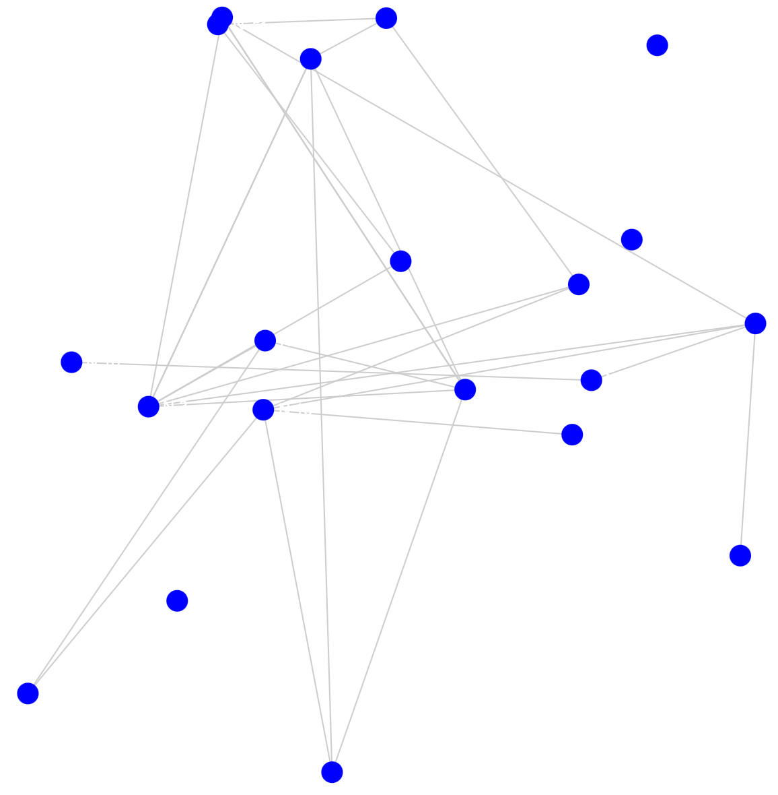
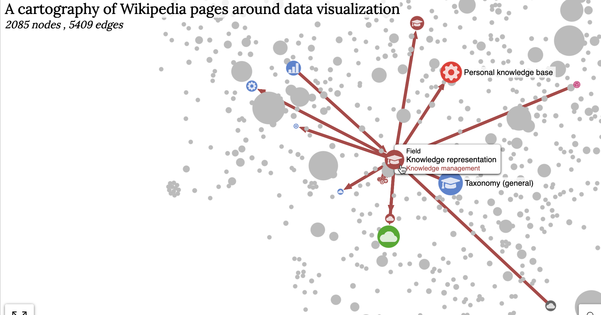

# Sigma JavaScript

{ width="400"}

[Link to Demo](./sigma.html){ .md-button .md-button--primary }

## Prompt

```linenums="0"
Create a Sigma.js web application that draws a graph network of 20 nodes. 
Draw the network graph on an 800x600 pixel canvas.
Make each node connected to 2 or 3 other nodes.
Draw the nodes as blue circles with white text labels.
Draw the labels for each node within the vertex circle.
```

## Response

Creating a Sigma.js web application to draw a graph network with the specified requirements involves a few steps, including setting up the HTML file, incorporating Sigma.js, and defining the graph data and presentation. Here's a step-by-step guide to achieve this:

1.  **HTML File Setup**: First, create an HTML file for your web application. This file will include the Sigma.js library and define the canvas where your network graph will be rendered.

2.  **Sigma.js Integration**: Sigma.js can be included in your project either by downloading the library and including it locally or by linking to a CDN (Content Delivery Network). For simplicity, we'll use a CDN.

3.  **Defining the Graph Data**: You'll need to define your nodes and edges. Each node should be connected to 2 or 3 other nodes as per your requirement.

4.  **Styling Nodes and Labels**: Sigma.js allows customizing the appearance of nodes and labels. You'll set the nodes to be blue circles with white text labels.

5.  **Drawing the Graph**: Finally, you'll initialize Sigma.js with your graph data on the specified canvas.

Here is a complete example that you can use as a template:

```html
<!DOCTYPE html>
<html>
<head>
    <title>Network Graph with Sigma.js</title>
    <style>
        #graph-container {
            width: 800px;
            height: 600px;
        }
    </style>
    <script src="https://cdnjs.cloudflare.com/ajax/libs/sigma.js/1.2.1/sigma.min.js"></script>
</head>
<body>
    <div id="graph-container"></div>
    <script>
        // Initialize sigma:
        var s = new sigma({
            renderer: {
                container: document.getElementById('graph-container'),
                type: 'canvas'
            },
            settings: {
                defaultNodeColor: '#0000FF',
                defaultLabelColor: '#FFFFFF',
                labelThreshold: 0,
                defaultLabelSize: 14,
                edgeColor: 'default',
                defaultEdgeColor: '#ccc'
            }
        });

        // Generate nodes and edges:
        var i, N = 20, E = 30;
        var g = {
            nodes: [],
            edges: []
        };

        // Add nodes:
        for (i = 0; i < N; i++) {
            g.nodes.push({
                id: 'n' + i,
                label: 'Node ' + i,
                x: Math.random(),
                y: Math.random(),
                size: 1,
                color: '#0000FF'
            });
        }

        // Add edges:
        for (i = 0; i < E; i++) {
            g.edges.push({
                id: 'e' + i,
                source: 'n' + (Math.floor(Math.random() * N)),
                target: 'n' + (Math.floor(Math.random() * N)),
                size: 1,
                color: '#ccc'
            });
        }

        // Load the graph in sigma:
        s.graph.read(g);

        // Refresh to display:
        s.refresh();
    </script>
</body>
</html>
```

This code snippet creates a Sigma.js instance targeting a `div` with an id of `graph-container`. It randomly generates 20 nodes and connects them with edges, ensuring each node is connected to 2 or 3 other nodes. The nodes are styled as blue circles with white text labels. Adjust the `size` in the node object to change the node size, and modify the `defaultLabelSize` in `settings` for label size adjustments.

Please note, this example generates a random graph. To control the exact connectivity (2 or 3 other nodes for each node), you would need to implement a more sophisticated algorithm for generating your nodes and edges.

ChatGPT can make mistakes. Consider checking important information.

## Version 2

To ensure the labels of the nodes appear directly within the blue vertex circles in Sigma.js, you can adjust the rendering settings and the node size to accommodate the text. Sigma.js automatically positions labels in the center of nodes by default. However, visibility and readability might depend on the node size and the length of the text.

Here are some adjustments and tips to ensure labels fit well inside the nodes:

1.  **Increase Node Size**: Make sure the node size is large enough to contain the text. Sigma.js uses the `size` attribute of a node to determine its radius. Increase this value to provide more space for the label.

2.  **Adjust Label Size**: If the labels are too large to fit inside the nodes even after adjusting the node size, you can reduce the label size. Use the `defaultLabelSize` setting for global adjustments or the `labelSize` attribute on individual nodes for specific adjustments.

3.  **Shorten Labels**: If the labels are too long to fit even with size adjustments, consider using shorter labels or abbreviations.

4.  **Custom Node Rendering (Advanced)**: For advanced customization, such as multi-line labels or specific label positioning, you might need to use custom node rendering. This involves writing a custom rendering function that draws the nodes and labels according to your specifications. Sigma.js provides the ability to extend or override the default rendering process, but this requires a good understanding of the library's rendering engine.


## Examples

A high-quality graph of data visualization concepts from Wikipedia:

Note the extensive use of icons.

## References

[Sigma Homepage](https://www.sigmajs.org/)