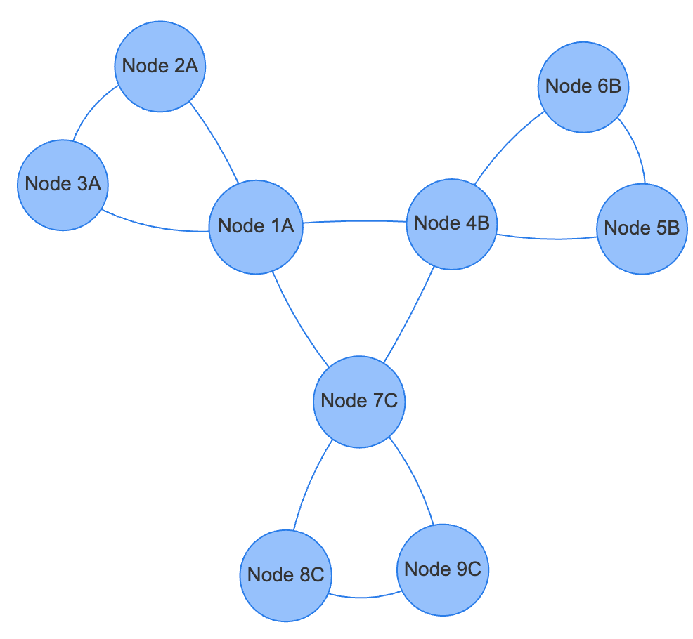

# Clustering in vis.js

Network diagrams get vary complicated.  As the number of vertices gets
larger, the network becomes more difficult to view and see key
relationships.

Here is an example of a flatened view of a small graph:



Note that there are vertices grouped by three letters: "A", "B" and "C".
In this lesson we will show you how to group communities of nodes
together under a single icon.  This allows you to quickly focus
in on the key nodes in a graph you are concerned with without
having the rest of the graph get in the way.

 What we would ideally like is to be able to group the nodes
 into ```domains```.  Each domain will have a label so
 that the software can quickly identify what nodes to cluster
 together or un-cluster to show internal detail.

Here is a high-level clustered view of the above graph network:


Here is a demonstration of opening a clustered node:

[Clustering Example 1](clustering-1.html)

Note that you can drag the cluster around and double click on a cluster to expand the nodes
within that cluster.

!!! Tip
    When generating network diagrams with vis.js,
    prefer the '''circle''' shape over the '''dot''' shape
    so the text appears inside the vertex, not under the vertex.

## Adding a Domain Property to Each Vertex

In the following examples, we will assign each node to
a specific domain using the ```domain``` property.
The values in the example are "A", "B", and "C" however
you can use any string for the domain value.

```js
var nodes = new vis.DataSet([
    { id: 1, label: 'Node 1A', domain: 'A' },
    { id: 2, label: 'Node 2A', domain: 'A' },
    { id: 3, label: 'Node 3A', domain: 'A' },

    { id: 4, label: 'Node 4B', domain: 'B' },
    { id: 5, label: 'Node 5B', domain: 'B' },
    { id: 6, label: 'Node 6B', domain: 'B' },

    { id: 7, label: 'Node 7C', domain: 'C' },
    { id: 8, label: 'Node 8C', domain: 'C' },
    { id: 9, label: 'Node 9C', domain: 'C' }
  ]);
```

## Cluster Drawing Properties

Our first step is to learn how to render a cluster.  We do this
by adding a ```clusterNodeProperies``` JSON data structure
to our program.  Here is an example that uses the ```square``` shape
for the clusters.


```js
clusterNodeProperties: {
    id: 'cluster:' + domain,
    label: 'Cluster ' + domain,
    shape: 'square', // Change shape to square
    size: 40,        // Increase size
    color: {
        border: 'orange',      // Set border color (e.g., orange)
        background: '#FFE5B4'   // Set background color (e.g., light orange)
    },
    font: { color: 'black' } // Set font color to black for readability
}
```

Note that we are contacting the string "cluster" to the domain to create the cluster
```id``` and we are using ```"Cluster" + domain``` for the label.

[Clustering Example 2](clustering-v2.html)

## Individual Cluster Colors

One of the key things we can do to each domain is to color the domain
icons with different colors.  Each domain can have a different
color for the boarder and the background of the icon.

To do this we will need to create a list of the domains and then
use this list to assign the color:

```js
var domainColors = {
      'A': { border: '#FF0000', background: '#FFCCCC' }, // Red
      'B': { border: '#00FF00', background: '#CCFFCC' }, // Green
      'C': { border: '#0000FF', background: '#CCCCFF' }  // Blue
    };
```

```js
clusterNodeProperties: {
   color: domainColors[domain]
}
```


```js
function clusterByDomain() {
  // Get unique domains from nodes
  var allNodes = nodes.get();
  var domains = [...new Set(allNodes.map(node => node.domain))];

  domains.forEach(function(domain) {
    // Define colors based on domain
    var domainColors = {
      'A': { border: '#FF0000', background: '#FFCCCC' }, // Red
      'B': { border: '#00FF00', background: '#CCFFCC' }, // Green
      'C': { border: '#0000FF', background: '#CCCCFF' }  // Blue
    };

    var clusterOptionsByData = {
      joinCondition: function(childNode) {
        return childNode.domain === domain;
      },
      clusterNodeProperties: {
        id: 'cluster:' + domain,
        label: 'Cluster ' + domain,
        shape: 'square',
        size: 40,
        color: domainColors[domain],
        font: { color: '#000000' }
      }
    };
    network.cluster(clusterOptionsByData);
  });
}
```

[Example 3: Colored Cluster Icons](clustering-v3.html)

## Repositioning Text

Next, we want the text to be positioned in the center of the cluster icon.
It would be nice to have a "centerLabel" property, but vis.js does not
support this.  Instead we must move the vertical positioning up
by setting negative distance.

```js
clusterNodeProperties: {
  font: {
    vadjust: -65,      // Adjust label position upwards
  }
}
```
[Example 4: Repositioning the Label Within the Square](./clustering-v4.html)

## Recollapse

Although we can now double click on each cluster to expand it, we might
change our mind and want the cluster to be collapsed again into a single
structure.  This allows uses to successively browse through each domain
in succession, opening and closing each domain.

To do this, we will need to add an event handler that will
close the domain if any of the nodes within that domain get
a double click.  Here is sample code to collapse a domain.

### Event Handler for Double-Click Events
```js
// Event handler for all double-click events on nodes
network.on("doubleClick", function (params) {
    if (params.nodes.length === 1) {
      // get the node we clicked on
      var nodeId = params.nodes[0];
      if (network.isCluster(nodeId) === true) {
        // Open the cluster
        network.openCluster(nodeId);
      } else {
        // Check if the node belongs to any cluster
        for (var clusterId in clusters) {
          if (clusters[clusterId].includes(nodeId)) {
            // Re-cluster the nodes
            recluster(clusterId);
            break;
          }
        }
      }
    }
});
```

The event handler checks if you clicked on a note that is in a cluster.
If the node is in a cluster and if is, it calls the ```recluster()``` function using
the ```clusterID``` as a parameter.  Here is that recluster function.

### The Recluster Function

This function gets called when you double-click on any node that is in
a cluster.  It extracts the domain name from the input clusterID
and then uses that domain to recluster the diagram using cluster
properties.

```js
// Function to re-cluster nodes into the cluster with the given clusterId
function recluster(clusterId) {
    var domain = clusterId.split(':')[1];  // Extract domain from clusterId

    var clusterOptionsByData = {
      joinCondition: function(childNode) {
        return childNode.domain === domain && childNode.id !== clusterId;
      },
      processProperties: function(clusterOptions, childNodes, childEdges) {
        // Update the mapping of cluster to its nodes
        clusters[clusterId] = childNodes.map(function(node) { return node.id; });

        // Set cluster properties
        clusterOptions.id = clusterId;
        clusterOptions.label = '<b>Cluster ' + domain + '</b>';
        clusterOptions.shape = 'square';
        clusterOptions.size = 50;
        clusterOptions.color = {
          border: 'orange',      // Orange border
          background: '#FFE5B4'   // Light orange background
        };
        clusterOptions.font = {
          color: '#000000',
          size: 16,
          vadjust: -35,
          align: 'horizontal',
          multi: true
        };
        return clusterOptions;
      },
      clusterNodeProperties: {
        allowSingleNodeCluster: false
      }
    };
    network.cluster(clusterOptionsByData);
}
```

[Example 5: Recollapseing the Cluster](./clustering-v5.html)

## Integrating Recollapse

[example 6](./clustering-v6.html)