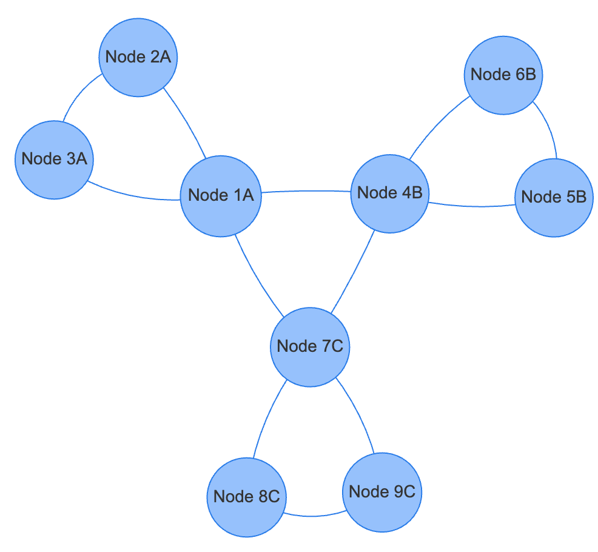
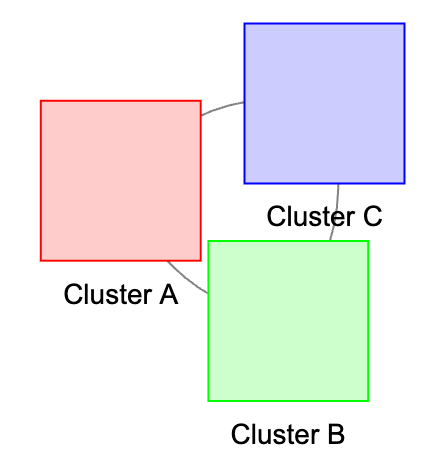
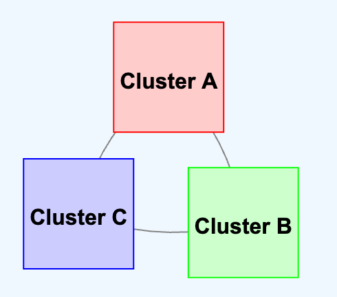
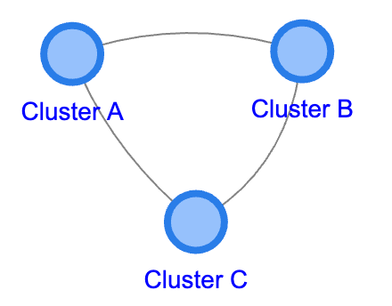

# Clustering in Graph Visualization

<iframe src="clustering-v6.html" width="100%" height="650px" scrolling="no"></iframe>

**Copy this iframe to your website:**

```html
<iframe src="https://dmccreary.github.io/graph-algorithms/sims/clustering/clustering-v6.html" width="100%" height="650px" scrolling="no"></iframe>
```

[Run Clustering MicroSim in Fullscreen](clustering-v6.html){ .md-button .md-button--primary }

## Description

Network diagrams can quickly get very complicated. As the number of vertices gets larger, the network becomes more difficult to view and see key relationships. We need ways to quickly collapse a group of nodes into a single symbol to reduce complexity. The primary tool we use to do this is called a graph node [cluster](../../glossary.md#cluster).

### What is a Cluster?

In graph theory, a cluster is a **composite node** that encapsulates a group of related nodes and their connections, formed based on specific criteria, to simplify and enhance the visualization of network diagrams. It serves as an interactive element that can be expanded or collapsed, allowing users to explore the network at different levels of detail while reducing visual complexity.

### Why Use Clusters?

- **Representation of Grouped Nodes**: A cluster acts as a higher-level abstraction, encapsulating several nodes (and their edges) into one composite node
- **Formation Criteria**: Clusters are formed based on specific conditions or attributes of the nodes, such as shared properties (e.g., a common `domain` attribute)
- **Interactivity**: Users can expand (open) a cluster to reveal the individual nodes or collapse them back
- **Visual Simplification**: Clustering reduces clutter, making large networks more manageable
- **Improves Performance**: Displaying fewer elements enhances rendering performance

### How to Use

1. Double-click on a cluster (square) to expand and see its contained nodes
2. Double-click on any node within an expanded cluster to re-collapse it
3. Drag clusters or nodes to rearrange the layout
4. Observe how edges connect between clusters and individual nodes

## Tutorial Labs

This MicroSim includes a progressive tutorial with six labs:

### Lab 1: Basic Interactive Clustering



[Simple Interactive Clustering Example 1 (expand only)](clustering-1.html)

Note: You can drag the cluster around and double click on a cluster to expand the nodes within that cluster.

### Lab 2: Adding Domain Properties

Nodes are assigned to domains using the `domain` property:

```js
var nodes = new vis.DataSet([
    { id: 1, label: 'Node 1A', domain: 'A' },
    { id: 2, label: 'Node 2A', domain: 'A' },
    { id: 3, label: 'Node 3A', domain: 'A' },
    // ...
]);
```

[Clustering Example 2](clustering-v2.html)

### Lab 3: Individual Cluster Colors

Each domain can have different colors for the border and background:



```js
var domainColors = {
    'A': { border: '#FF0000', background: '#FFCCCC' }, // Red
    'B': { border: '#00FF00', background: '#CCFFCC' }, // Green
    'C': { border: '#0000FF', background: '#CCCCFF' }  // Blue
};
```

[Example 3: Colored Cluster Icons](clustering-v3.html)

### Lab 4: Repositioning Text



[Example 4: Repositioning the Label Within the Square Cluster](./clustering-v4.html)

### Lab 5: Re-collapse Functionality

[Example 5: Re-collapsing the Cluster](./clustering-v5b.html)

### Lab 6: Complete Integration

[Example 6: Full Integration](./clustering-v6.html)

## Example: Domain Clusters



When building large complex data models, we can group nodes into domains of similar items. For example:

- **Geospatial domain**: Location, Address, City, State, Country
- **Lexical domain**: Documents, DocumentSections, DocumentChunks, Entities, Concepts

## Lesson Plan

### Learning Objectives

After completing this lesson, students will be able to:

- Explain the purpose and benefits of clustering in graph visualization
- Implement domain-based clustering using vis-network.js
- Create interactive expand/collapse functionality for clusters
- Customize cluster appearance (colors, shapes, labels)

### Target Audience

- Intermediate web developers learning data visualization
- Prerequisites: Basic JavaScript, HTML, understanding of graph data structures

### Activities

1. **Exploration Activity**: Work through Labs 1-3 to understand basic clustering
2. **Guided Investigation**: Modify the domain colors and cluster shapes in Lab 3
3. **Extension Activity**: Add a fourth domain "D" with its own color scheme

### Assessment

- What are the benefits of clustering in large network visualizations?
- How does the `joinCondition` function determine which nodes belong to a cluster?
- Describe the difference between expanding and re-collapsing a cluster

## References

- [vis-network.js Clustering Documentation](https://visjs.github.io/vis-network/docs/network/index.html#Clustering) - Official clustering API documentation
- [vis-network.js Examples](https://visjs.github.io/vis-network/examples/) - Example implementations
- [Graph Clustering - Wikipedia](https://en.wikipedia.org/wiki/Cluster_(graph_theory)) - Theory of graph clustering
