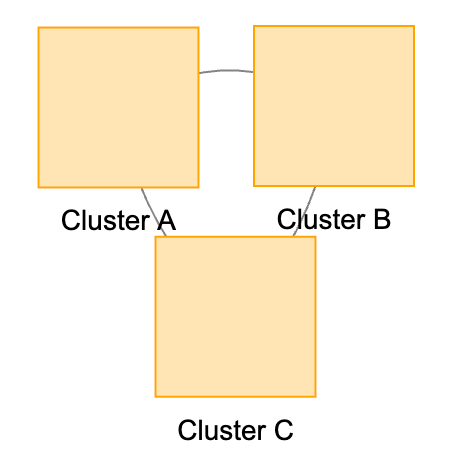

# Clustering in vis.js


[example](clustering.html)

Double click on a cluster to expand

## Cluster Drawing Properties



```js
clusterNodeProperties: {
    id: 'cluster:' + domain,
    label: 'Cluster ' + domain,
    shape: 'square', // Change shape to square
    size: 40,        // Increase size
    color: {
        border: '#FFA500',      // Set border color (e.g., orange)
        background: '#FFE5B4'   // Set background color (e.g., light orange)
    },
    font: { color: '#000000' } // Set font color to black for readability
}
```


[example 2](clustering-v2.html)

## Individual Cluster Colors


```js
function clusterByDomain() {
  // Get unique domains from nodes
  var allNodes = nodes.get();
  var domains = [...new Set(allNodes.map(node => node.domain))];

  domains.forEach(function(domain) {
    // Define colors based on domain
    var domainColors = {
      'A': { border: '#FF0000', background: '#FFCCCC' }, // Red
      'B': { border: '#00FF00', background: '#CCFFCC' }, // Green
      'C': { border: '#0000FF', background: '#CCCCFF' }  // Blue
    };

    var clusterOptionsByData = {
      joinCondition: function(childNode) {
        return childNode.domain === domain;
      },
      clusterNodeProperties: {
        id: 'cluster:' + domain,
        label: 'Cluster ' + domain,
        shape: 'square',
        size: 40,
        color: domainColors[domain],
        font: { color: '#000000' }
      }
    };
    network.cluster(clusterOptionsByData);
  });
}
```

[example 3](clustering-v3.html)

## Repositioning Text

[example 4](./clustering-v4.html)

## Recollapse

[example 5](./clustering-v5.html)