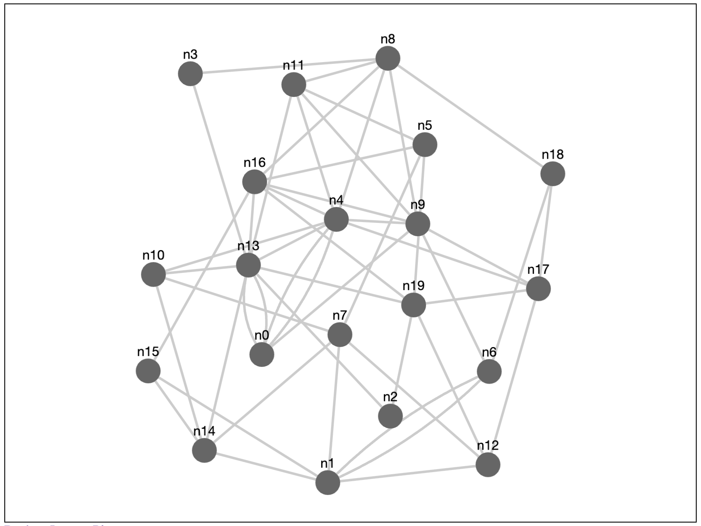
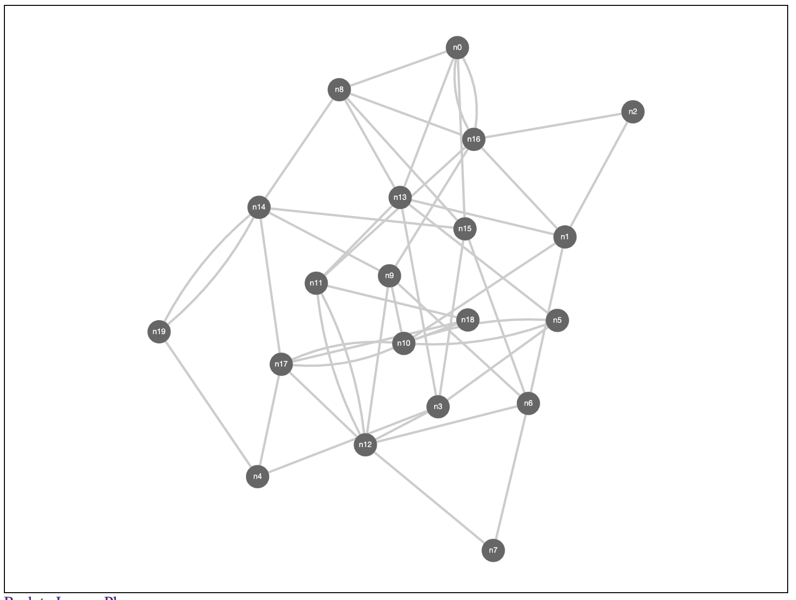

# Cytoscape.js

{ width="400" }


[Run the Cytosscape.js Demo](./cytoscape.html){ .md-button .md-button--primary }
[HTML]()
[JavaScript]()

## Prompt

```linenums="0"
Create a cytoscape.js application that draws a force-directed graph layout.
Have the application generate 20 vertices
and make each vertex be connected to either two or three other vertices.
```

## GTP-4 Response

Creating a force-directed graph with Cytoscape.js involves a few steps, 
including setting up a basic HTML/CSS/JavaScript environment, 
initializing Cytoscape with a configuration object, 
defining the graph elements (nodes and edges), 
and specifying a layout algorithm. Below is a simple example 
application that meets your specifications.

### 1\. HTML Boilerplate

First, you need an HTML document to host the graph. This document includes a reference to the Cytoscape.js library.

```html
<!DOCTYPE html>
<html lang="en">
<head>
    <meta charset="UTF-8">
    <title>Force-Directed Graph</title>
    <style>
        #cy {
            width: 800px;
            height: 600px;
            display: block;
            border: 1px solid black;
        }
    </style>
    <script src="https://unpkg.com/cytoscape@3.19.1/dist/cytoscape.min.js"></script>
</head>
<body>
    <div id="cy"></div>
    <script src="app.js"></script>
</body>
</html>
```

### 2\. JavaScript for Graph (app.js)

You'll need to create an `app.js` file with the JavaScript code to generate the graph. 
This code initializes Cytoscape with a specified container and 
configuration, generates 20 vertices (nodes), and 
randomly connects each node to two or three others.

```javascript
document.addEventListener('DOMContentLoaded', function() {
    let cy = cytoscape({
        container: document.getElementById('cy'),
        elements: generateGraphElements(20),
        style: [
            {
                selector: 'node',
                style: {
                    'background-color': '#666',
                    'label': 'data(id)'
                }
            },
            {
                selector: 'edge',
                style: {
                    'width': 3,
                    'line-color': '#ccc',
                    'curve-style': 'bezier'
                }
            }
        ],
        layout: {
            name: 'cose',
            idealEdgeLength: 100,
            nodeOverlap: 20,
            refresh: 20,
            fit: true,
            padding: 30,
            randomize: false,
            componentSpacing: 100,
            nodeRepulsion: 400000,
            edgeElasticity: 100,
            nestingFactor: 5,
            gravity: 80,
            numIter: 1000,
            initialTemp: 200,
            coolingFactor: 0.95,
            minTemp: 1.0
        }
    });
});

function generateGraphElements(vertexCount) {
    let elements = [];
    for (let i = 0; i < vertexCount; i++) {
        elements.push({ data: { id: 'n' + i } });
    }

    for (let i = 0; i < vertexCount; i++) {
        let edgeCount = Math.random() > 0.5 ? 2 : 3; // Randomly 2 or 3 edges
        let connected = new Set();
        while(connected.size < edgeCount) {
            let targetIndex = Math.floor(Math.random() * vertexCount);
            if(targetIndex !== i && !connected.has(targetIndex)) {
                elements.push({ data: { source: 'n' + i, target: 'n' + targetIndex } });
                connected.add(targetIndex);
            }
        }
    }

    return elements;
}
```

### How It Works

-   The HTML file sets up a webpage with a `<div>` element where the graph will be rendered.
-   The CSS styles define the size of the graph's container and some basic styles for the nodes and edges.
-   The JavaScript (`app.js`) uses Cytoscape.js to create a graph inside the specified container. It defines a `generateGraphElements` function to dynamically create nodes and edges. Each node is connected to either two or three other nodes randomly.
-   The graph layout is set to use Cytoscape's `cose` layout, a force-directed layout algorithm, which positions the nodes in an aesthetically pleasing manner based on their connections.

## Version 2



What if we want the label to display within the vertex circle?
In Cytoscape this can be done by just changing a few lines of the style
element.  This shows that the library has
a clear separation of the UI and the back-end model.

[Run the Cytoscape.js V2 Demo](./cytoscape-v2.html){ .md-button .md-button--primary }

### Prompt

```linenums="0"
That worked perfectly.  Thank you!
How would I modify the program to place the names of 
each node inside the circle of the vertex?
```
 ### Response

 To modify the program so that the names of each node appear inside the circle of the vertex, you need to adjust the `style` configuration for the nodes in the Cytoscape.js initialization object. Specifically, you will modify the `label` property within the node style definition to display the node's id (or any other identifier you have assigned to the `data` of each node). This will place the label inside the node by default.

Here is how you can adjust the `style` section of your Cytoscape.js configuration:

```javascript
style: [
    {
        selector: 'node',
        style: {
            'background-color': '#666',
            'label': 'data(id)', // This line configures the label to be the node id
            'text-valign': 'center', // Vertically center the text inside the node
            'text-halign': 'center', // Horizontally center the text inside the node
            'color': '#fff', // Set the text color to white for better visibility
            'font-size': '10px' // Adjust the font size as needed
        }
    },
    {
        selector: 'edge',
        style: {
            'width': 3,
            'line-color': '#ccc',
            'curve-style': 'bezier'
        }
    }
],
```

In this modified style configuration, the `text-valign` and `text-halign` properties ensure that the text is centered both vertically and horizontally within the node. The `color` property changes the text color, and `font-size` can be adjusted to fit the text within the nodes comfortably.

Remember, the `label` property is set to `'data(id)'`, which means it will display the `id` of each node. If you're using a different identifier or if you want to display another piece of data, you'll need to adjust this to match the data attribute you wish to display (e.g., `'data(name)'` if each node's data includes a `name` attribute).

Integrating this style configuration into your Cytoscape.js setup will result in the node names (or ids) being displayed inside the circles of each vertex, enhancing the readability and informational value of the graph.