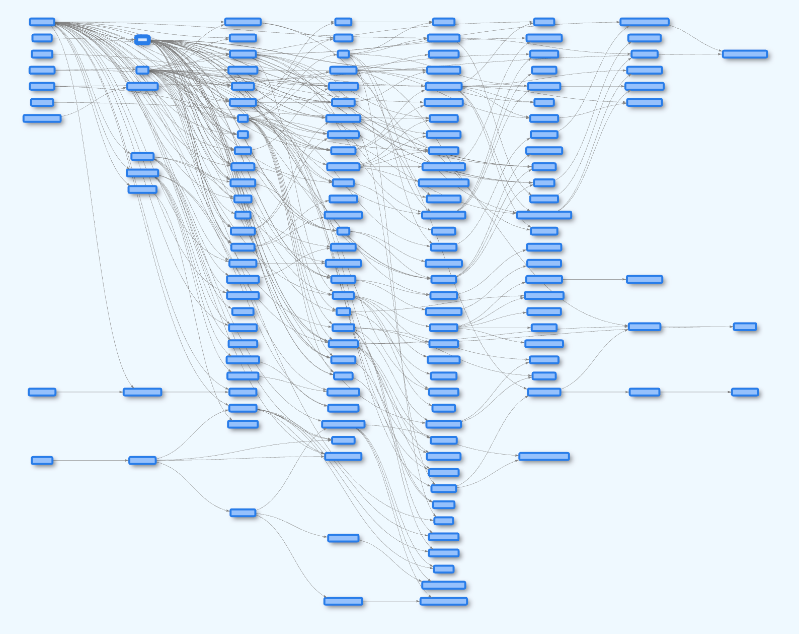

# LR DAG Viewer

In this lesson we use the left to right layout (LR) of a DAG using the vis.js library.
This algorithm places each node in one of about eight columns and arranges nodes in a DAG based on their dependencies, with independent nodes on the right and dependent nodes on the left. 

[Run the LR DAG Viewer MicroSim](./dag-viewer.html){ .md-button .md-button--primary }

The program uses the graph-algorithms learning graph CSV file

[View the Graph Algorithms Learning Graph CSV File](./graph-algorithms.csv)

## Tuning the Layout

## Sample Prompt

!!! prompt
    I have a directed acyclic graph (DAG) and I want you to create a vis.js program so that the placement of the nodes on the graph always place dependant nodes to the left of a node.  Nodes with no dependencies should be on the right side of the canvas.

    Use the following vis.js library reference from unpkg.com:

    https://unpkg.com/vis-network/standalone/umd/vis-network.min.js

    Use the following parameters in the vis.js options:

    const options = {
        layout: {
            hierarchical: {
                enabled: true,
                direction: 'LR',  // Left to right
                sortMethod: 'directed',
                nodeSpacing: 80,
                levelSeparation: 500
            }
        }}

## Version 2

[DAG Viewer 2](dag-viewer-2.html)

## Version 3

[DAG Viewer 3](dag-viewer-3.html)

## Version 4

The solution was to rely on precise static positioning rather than physics-based layout for this directed acyclic graph visualization.
The key insight was that since we're dealing with a hierarchical dependency structure where nodes need to maintain their horizontal levels, physics simulation wasn't actually necessary - it was just complicating things and causing issues. By using fixed positions calculated from the dependency levels, we get a clearer and more stable visualization that better serves the purpose of showing the relationships between concepts.

[DAG Viewer 4](dag-viewer-4.html)