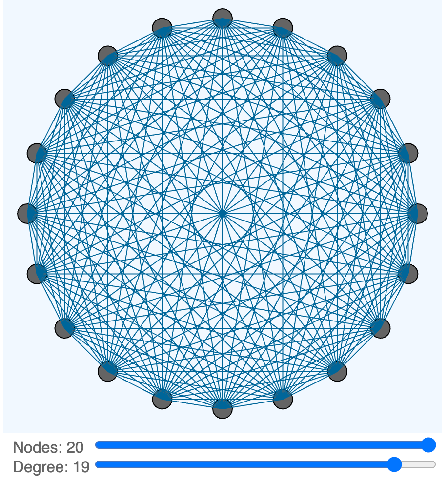

# Degree V2

{ width="400" }

[Run the Degree V2 MicroSim](degree-v2.html){ .md-button .md-button--primary }

[Edit the Degree V2 MicroSim](https://editor.p5js.org/dmccreary/sketches/yHTEP4S_c)

## Prompt

```linenums="0"
Create a p5.js sketch on a 500x600 canvas.
This sketch demonstrates how the degree of a network graph changes based on the number of connections between vertices of the graph.
The drawing region is 500x500.
The control region is the bottom 100 below the drawing region.
Set a global variable of canvasWidth to be 500.
Set a global variable of drawingHeight to be 500.
Set a global variable of controlRegionHeight to be 100.
Set a global variable of leftMargin to be 100.
Use the leftMargin to place the label and values of the sliders in the control region.
At the beginning of each draw, draw the background of the drawing region in aliceblue.
Draw the background of the control region white.
Create a function that draws N small circles around the edge of a large circle.
N is a parameter of the function.
Create another function that draws the network between the edges circles with the degree from the degreeSlider.
The small circles are spaced evenly around the edge of the large circle.
The small circles have a maximum radius of 20.
The large circle has a radius of 230.
Add a slider called nSlider that changes the number of small circles on the edge of the large circle.
The range of nSlider is from 4 to 20 with a default value of 10.
Add a second slider called degreeSlider that changes the number of edges between each small circle and other small circles.
The degreeSlider ranges from 1 to N.
Draw lines from each small circle to others based on the degree slider.
Draw the label and values in the leftMargin of the controls.
Make the size of the sliders be the canvasWidth less the leftMargin.
```

## Sample Code

```js
// Network Graph Degree Demo
let canvasWidth = 450;
let drawingHeight = 450;
let xCenter = canvasWidth / 2;
let yCenter = drawingHeight / 2;
let controlRegionHeight = 60;
let nSlider, degreeSlider;
let leftMargin = 100;

function setup() {
  createCanvas(canvasWidth, drawingHeight + controlRegionHeight);
  textSize(16);
  
  // slider to control the number of vertices on the edge of the circle
  nSlider = createSlider(4, 20, 10, 1).position(leftMargin, canvasWidth + 10);
  nSlider.size(canvasWidth-leftMargin);
  
  // slider to control the degree of connections
  degreeSlider = createSlider(1, 10, 4, 1).position(leftMargin, canvasWidth + 30);
  degreeSlider.size(canvasWidth-leftMargin);
}

function draw() {
  fill('aliceblue');
  rect(0,0,canvasWidth, drawingHeight);
  fill('white');
  rect(0,drawingHeight,canvasWidth, controlRegionHeight);
  
  // get the updates from any changes in the slider values
  numberNodes = nSlider.value();
  degreeValue = degreeSlider.value();
  
  // what we want is the degree to be less than the number of nodes
  if (degreeValue > numberNodes) {
    degreeValue = numberNodes;
    // update the degree
    degreeSlider.value(numberNodes); 
  }
  
  drawNetwork(xCenter, yCenter, 200, numberNodes);
  drawLines(xCenter, yCenter, 200, numberNodes, degreeValue);
  // degreeSlider.attribute('max', nSlider.value()); // Ensure degreeSlider max does not exceed nSlider value
  
  // Draw labels and values
  noStroke();
  text('Nodes: ' + numberNodes, 10, drawingHeight + 20);
  text('Degree: ' + (degreeValue*2), 10, drawingHeight + 40);

}

function drawNetwork(x, y, largeCircleRadius, n) {
  let angle = TWO_PI / n;
  stroke(0);
  fill(255);
  // ellipse(x, y, largeCircleRadius * 2, largeCircleRadius * 2); // Draw large circle
  for (let i = 0; i < n; i++) {
    let xOff = cos(angle * i) * largeCircleRadius;
    let yOff = sin(angle * i) * largeCircleRadius;
    fill(100);
    circle(x + xOff, y + yOff, 20); // Draw small circles
  }
}

// note that degree is half what we see on the canvas
function drawLines(x, y, largeCircleRadius, n, degree) {
  let angle = TWO_PI / n;
  for (let i = 0; i < n; i++) {
    for (let j = 1; j <= degree; j++) {
      let iAngle = angle * i;
      let jAngle = angle * ((i + j) % n); // Wrap around the circle
      let x1 = cos(iAngle) * largeCircleRadius + x;
      let y1 = sin(iAngle) * largeCircleRadius + y;
      let x2 = cos(jAngle) * largeCircleRadius + x;
      let y2 = sin(jAngle) * largeCircleRadius + y;
      stroke(0, 102, 153);
      line(x1, y1, x2, y2); // Draw line between vertices
    }
  }
}
```
!!! Note
    There is a bug in the code that tries to make sure that
    the degree is always less than the number of nodes.

[Random Node Distribution Example](https://editor.p5js.org/dmccreary/sketches/LzAtUbzWf)