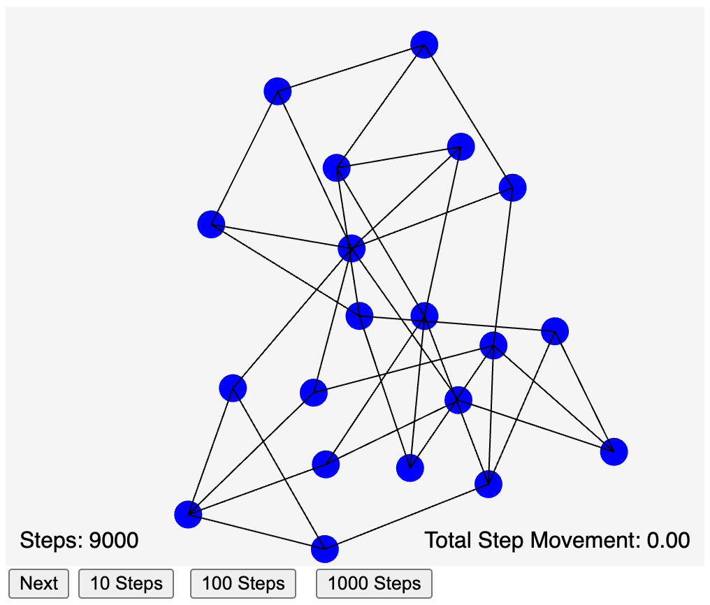

# Force Directed Graph Layout



[Force Directed Graph on the MicroSims Site](https://dmccreary.github.io/microsims/sims/force-directed-graph/)

## Sample Prompt

```linenums="0"
Create a simulation of a force-directed graph placement algorithm.
Generate a single file p5.js sketch on a 500x400 canvas.
Set global variables for the width and height of the canvas.
The algorithm will move the position of vertices of a connected
   based on a force-directed graph placement mode.
For the initial state,  place 20 vertices on random locations on a 500x400 canvas. 
Make the vertices be rendered by a circle with a radius of 10.
Connect each vertex to 3 other vertices using bidirectional links.
Add a controls to incrementally step through the algorithm.
Add buttons for a single Step, 10 Steps, 100 Steps and 1,000 Steps at the bottom of canvas.
Display the number of steps, and the total movement of the verticies in
each step.
```