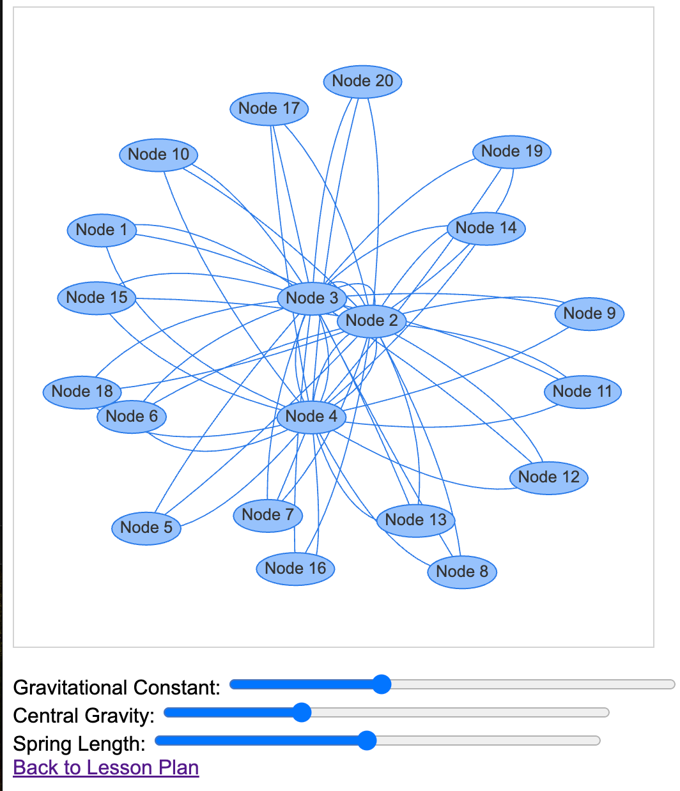

# Demonstration of the vis.js Graph Library

{ width="400px"}

## Random Layout Prompt

```linenums="0"
Please create a vis.js program that displays a network graph of 20 vertices
that are randomly placed on a 500x500 canvas.  Have each node
be connected to the three nearest nodes.
```

## Random Layout Response

To create a program using vis.js that displays a network graph of 20 vertices randomly placed on a 500x500 canvas, with each node connected to the three nearest nodes, you will need to follow these steps:

1.  **Include vis.js Library**: First, make sure to include the vis.js library in your HTML file. You can do this by adding a script tag linking to the vis.js CDN.

2.  **HTML Structure**: Set up a basic HTML structure with a div element where the graph will be rendered.

3.  **JavaScript Code**:

    -   **Create Nodes**: Generate 20 random nodes, each with a unique id and random x, y coordinates within the 500x500 canvas.
    -   **Calculate Distances and Create Edges**: For each node, calculate the distance to every other node, then connect it to the three nearest nodes.
    -   **Vis.js Network**: Use the vis.js Network module to render the graph.
4.  **Styling (Optional)**: Add some CSS to style the canvas or control the appearance of the nodes and edges.

Here's an example implementation:

[Run the vis.js Demo](./vis.html){ .md-button .md-button--primary }

This code creates a simple network graph using vis.js, with 20 nodes randomly placed on a 500x500 canvas. Each node is connected to its three nearest neighbors. The graph is static and does not use physics for layout since the positions are fixed and pre-determined.

## Force Directed Graph

 { width="400px"}

### Prompt

```linenums="0"
That was perfect!  Can you now create the same graph using
a force directed layout algorithm to space the nodes apart?
```

Certainly! To create a network graph using a force-directed layout, you'll modify the JavaScript part of your previous code. In a force-directed layout, nodes are spaced apart naturally based on the physics simulation provided by the vis.js library.

You won't need to manually set the `x` and `y` coordinates for each node. Instead, you'll let the physics engine handle the positioning. I'll remove the `fixed` and `physics` properties from the node creation, and also adjust the options to enable and fine-tune the physics simulation.

Here's the updated JavaScript code:

[Run the vis.js Force Directed Graph Demo](./vis-force.html){ .md-button .md-button--primary }

In this code:

-   The `nodes` array no longer includes specific coordinates for each node. The force-directed layout will determine the positions.
-   The `physics` options are set to use the `barnesHut` solver, which is effective for force-directed layouts. The parameters like `gravitationalConstant`, `centralGravity`, `springLength`, etc., are adjusted to control the spacing and the strength of forces in the layout.
-   The `stabilizationIterationsDone` event listener is added to get the updated positions of the nodes once the network is stabilized.

This setup will create a network graph where nodes are automatically positioned in a visually appealing, spaced-out manner according to the physics simulation.

## Vis Force Sliders



## Prompt

```linenums=""
Perfect!  Can you now create a new version with 3 input sliders below the drawing canvas that adjusts the following three parameters:

gravitationalConstant
centralGravity
springLength
```

[Vis Force Sliders](./vis-force-sliders.html){ .md-button .md-button--primary }