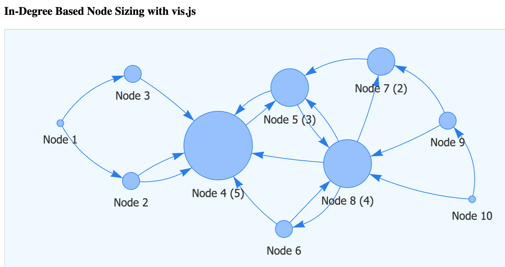

# In-Degree Node Size



[Run In-degree Node Size MicroSim](./indegree-node-size-v1.html){ .md-button .md-button--primary }

[In-degree Node Size MicroSim V2](./indegree-node-size-v2.html)

[In-degree Node Size MicroSim V3](./indegree-node-size-v3.html)

[In-degree Node Size MicroSim V4](./indegree-node-size-v3.html)


[In-degree Node Size MicroSim Base](./indegree-node-size.html)

## Prompt

```linenums="0"
Create a demonstration vis.js program that demonstrates
how the size of a node can be larger as the in-degree
of the vertex increases.
```

###### ChatGPT Response

Here's a demonstration program using `vis.js` where the node size dynamically increases with the in-degree of each vertex. In this example, each time a node receives an incoming edge, its size increases proportionally to the in-degree count.

```html
<!DOCTYPE html>
<html lang="en">
<head>
    <meta charset="UTF-8">
    <meta name="viewport" content="width=device-width, initial-scale=1.0">
    <title>vis.js In-Degree Based Node Sizing</title>
    <script type="text/javascript" src="https://unpkg.com/vis-network/standalone/umd/vis-network.min.js"></script>

    <style>
        #network {
            width: 800px;
            height: 600px;
            border: 1px solid lightgray;
        }
    </style>
</head>
<body>
    <h3>In-Degree Based Node Sizing with vis.js</h3>
    <div id="network"></div>

    <script type="text/javascript">
        // Create an array with nodes
        const nodes = new vis.DataSet([
            { id: 1, label: 'Node 1', value: 1 },
            { id: 2, label: 'Node 2', value: 1 },
            { id: 3, label: 'Node 3', value: 1 },
            { id: 4, label: 'Node 4', value: 1 },
            { id: 5, label: 'Node 5', value: 1 }
        ]);

        // Create an array with edges
        const edges = new vis.DataSet([
            { from: 1, to: 2 },
            { from: 1, to: 3 },
            { from: 2, to: 4 },
            { from: 3, to: 4 },
            { from: 4, to: 5 },
            { from: 5, to: 3 }
        ]);

        // Calculate in-degrees and update node sizes
        function updateNodeSizes() {
            const inDegrees = {};

            // Initialize in-degree count
            nodes.forEach(node => inDegrees[node.id] = 0);

            // Calculate in-degrees from edges
            edges.forEach(edge => {
                inDegrees[edge.to] = (inDegrees[edge.to] || 0) + 1;
            });

            // Update node sizes based on in-degree
            nodes.forEach(node => {
                const inDegree = inDegrees[node.id] || 0;
                node.value = Math.max(5, 10 + inDegree * 5);  // Base size + multiplier
                nodes.update(node);
            });
        }

        // Initialize the network
        const container = document.getElementById('network');
        const data = { nodes: nodes, edges: edges };
        const options = {
            nodes: {
                shape: 'dot',
                scaling: {
                    min: 5,
                    max: 50
                },
                font: { size: 16, face: 'Tahoma' },
            },
            edges: {
                arrows: 'to'
            },
            physics: false
        };
        const network = new vis.Network(container, data, options);

        // Update node sizes based on in-degree
        updateNodeSizes();
    </script>
</body>
</html>
```

### Explanation:

1.  **Nodes and Edges:** A set of nodes and edges is created initially.
2.  **In-Degree Calculation:** A helper function `updateNodeSizes()` calculates the in-degree of each node by counting incoming edges.
3.  **Node Sizing Based on In-Degree:** The node `value` attribute is updated to reflect the in-degree, where each node's size increases by a certain amount per incoming edge.
4.  **Rendering:** The network is initialized with `vis.js`, and nodes will appear larger for higher in-degrees.

This example provides a clear visual where nodes with higher in-degrees will appear larger in the network.

## Resizing Boxes

```html
<!DOCTYPE html>
<html lang="en">
<head>
    <meta charset="UTF-8">
    <meta name="viewport" content="width=device-width, initial-scale=1.0">
    <title>vis.js In-Degree Based Node Sizing with Box Shapes</title>
    <script type="text/javascript" src="https://unpkg.com/vis-network@9.1.2/dist/vis-network.min.js"></script>
    <style>
        #network {
            width: 800px;
            height: 600px;
            border: 1px solid lightgray;
        }
    </style>
</head>
<body>
    <h3>In-Degree Based Node Sizing with Box Shapes in vis.js</h3>
    <div id="network"></div>

    <script type="text/javascript">
        // Create an array with nodes
        const nodes = new vis.DataSet([
            { id: 1, label: 'Node 1', shape: 'box' },
            { id: 2, label: 'Node 2', shape: 'box' },
            { id: 3, label: 'Node 3', shape: 'box' },
            { id: 4, label: 'Node 4', shape: 'box' },
            { id: 5, label: 'Node 5', shape: 'box' }
        ]);

        // Create an array with edges
        const edges = new vis.DataSet([
            { from: 1, to: 2 },
            { from: 1, to: 3 },
            { from: 2, to: 4 },
            { from: 3, to: 4 },
            { from: 4, to: 5 },
            { from: 5, to: 3 }
        ]);

        // Calculate in-degrees and update node sizes
        function updateNodeSizes() {
            const inDegrees = {};

            // Initialize in-degree count
            nodes.forEach(node => inDegrees[node.id] = 0);

            // Calculate in-degrees from edges
            edges.forEach(edge => {
                inDegrees[edge.to] = (inDegrees[edge.to] || 0) + 1;
            });

            // Update node sizes based on in-degree
            nodes.forEach(node => {
                const inDegree = inDegrees[node.id] || 0;
                node.width = Math.max(50, 50 + inDegree * 10);  // Base width + multiplier
                node.height = Math.max(30, 30 + inDegree * 5);  // Base height + multiplier
                nodes.update(node);
            });
        }

        // Initialize the network
        const container = document.getElementById('network');
        const data = { nodes: nodes, edges: edges };
        const options = {
            nodes: {
                font: { size: 16, face: 'Tahoma' },
            },
            edges: {
                arrows: 'to'
            },
            physics: false
        };
        const network = new vis.Network(container, data, options);

        // Update node sizes based on in-degree
        updateNodeSizes();
    </script>
</body>
</html>
```
## Resizing Boxes

### Prompt

```linenums="0"
How can I get "box" elements to also change their size?
This only seems to work for "dot" nodes.
```

### ChatGPT Response

In `vis.js`, resizing nodes based on the `value` property works by default for "dot" shapes, but not for other shapes like "box." To achieve this for "box" nodes, you'll need to explicitly set the `width` and `height` properties of each node rather than relying on the `value` property. Here's how you can modify the code to handle the resizing of "box" nodes:

### Explanation of Changes

1.  **Box Shape:** Each node is set to the `shape: 'box'`.
2.  **Explicit Width and Height Adjustments:** Instead of using the `value` property, the `width` and `height` properties of each node are adjusted based on the in-degree count. This allows "box" nodes to resize according to the number of incoming edges.
3.  **Custom Sizing Logic:** For each node, `width` and `height` are adjusted with base values (`50` for width and `30` for height) and multipliers to make the size proportional to the in-degree.

This code dynamically adjusts the dimensions of "box" nodes based on their in-degrees, providing a similar visual impact as with "dot" nodes.

## References

[ChatGPT Dialog on In-Degree Node Sizing](https://chatgpt.com/share/672ca784-3d18-8001-996c-bca3496a0756)
